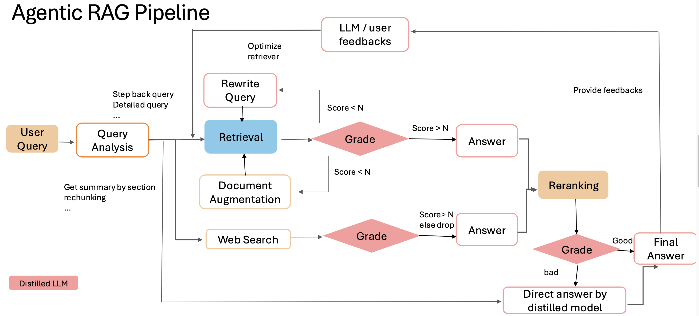

# Agentic RAG Pipeline using Distilled LLM



## Project Overview
This implementation demonstrates an Agentic Retrieval-Augmented Generation (RAG) system enhanced with:
1. **Knowledge Distillation** of a large teacher model to create a efficient student model
2. **Multi-stage Query Processing** architecture for complex problem-solving

The pipeline achieves significant improvements in both response quality and computational efficiency through strategic combination of model distillation and retrieval-augmented generation.

---

## Distillation Dataset Distribution
| Domain         | Percentage | Sample Size |
|-----------------|------------|-------------|
| General Knowledge | 91%        | 3,630       |
| Grammar        | 2.5%       | 100         |
| Science         | 2.5%       | 100         |
| Mathematics      | 2.5%       | 100         |
| Programming     | 1.5%       | 50          |

---

## Technical Objectives
1. **Model Compression**
   - Distill a large-scale LLM (e.g., LLaMA-2-7B) into a compact student model (3B parameters)
   - Achieve >90% parameter reduction while maintaining ≥85% task performance

2. **Advanced RAG Implementation**
   - Multi-retrieval strategy combining text search and semantic embeddings
   - Context-aware query rephrasing module
   - Iterative refinement mechanism for complex queries

---

## Getting Started

### Prerequisites
1. Python 3.8+ and pipenv
2. Ollama v2.1+ or compatible LLM server
3. API access to knowledge base (configurable in `config.toml`)
4. If you want to deploy local model, you need to download ollama and run the serve by `ollama run $MODELNAME`
5. talk with llm `python llm_response.py`

### Installation
```bash
pip install -r requirements.txt
```

### Run on your own data
1. mkdir input_docs
2. put your PDF files into input_docs.
3. run `python data_precessing.py`
4. the vector will be stored in vec_db/

### Performance
#### Model Performance
| Model Name       | Performance                               |
|-----------------|-----------------------------------------|
| LLaMA 3B       | Unacceptable, very slow                 |
| LLaMA 3B Q4_K_M | Unacceptable, poor answer quality      |
| LLaMA 8B Q4_K_M | Acceptable                             |
| LLaMA 8B Q8_0   | Unacceptable, good answer but very slow |

### Benchmark
| Model Name         | Faithfulness | Relevancy | Context Precision | Answer Correctness |
|--------------------|-------------|-----------|-------------------|-------------------|
| Qwen-Plus         | 92.83%       | 93.61%    | 59.77%            | 45.19%            |
| GPT-4o            | 89.70%       | 92.30%    | 54.60%            | 46.56%            |
| LLaMA 3B          | 76.83%       | 35.06%    | 36.78%            | 35.17%            |
| Distilled LLaMA 8B | 80.96%       | 74.86%    | 54.31%            | 44.62%            |

### Cost Estimation
| Cost Item               | Stage            | Estimated Period                |
|-------------------------|-----------------|---------------------------------|
| Teacher Model API       | Data Distillation | < 1 week, 10k-15k calls        |
| GPU                     | Fine-tuning      | < 1 week, 1 normal GPU is enough |
| VM/Deployment Platform  | Deployment       | Depends on the use case        |
